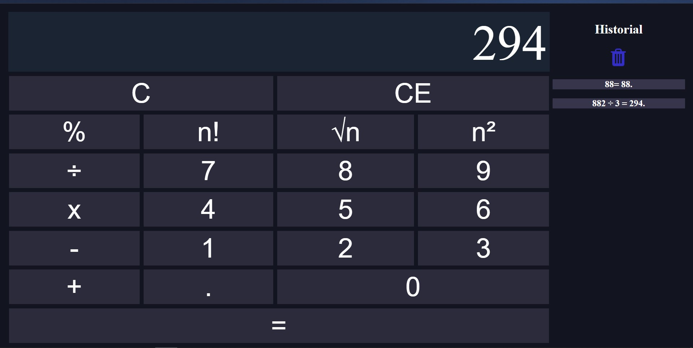

## Calculator 

 **English Description**

#### Functional Web Calculator.
#### ** Note!: ** You can use the Keyboard to set the values (0-9), evalute (Enter) and / or clean a single value (Escape).

1. ### Default operations : da
    
    - #### Sum
    - #### Sustraction
    - #### Multiply
    - #### Division

2. ### Additional functions to calculate 
   ### (Does not necessary to use = or Enter) :

 - #### Factorial of a number.
 - #### Square root of a number.
 - #### Elevate a number twice.
 - #### Module of a number.

3. ### History of the maded operations.
 
**Descripcion en español**

#### Calculadora web funcional.
#### ** ¡Nota!: ** Puede usar el teclado para establecer los valores (0-9), evaluar (Enter) y/o limpiar un solo valor (Escape).

1. ### Operaciones por defecto:
    
      - #### Suma
      - #### Resta
      - #### Multiplicar
      - #### División

2. ### Funciones adicionales para calcular
     ### (No es necesario usar = o Enter) :

   - #### Factorial de un número.
   - #### Raíz cuadrada de un número.
   - #### Elevar un número dos veces.
   - #### Módulo de un número.

3. ### Historial de las operaciones realizadas.